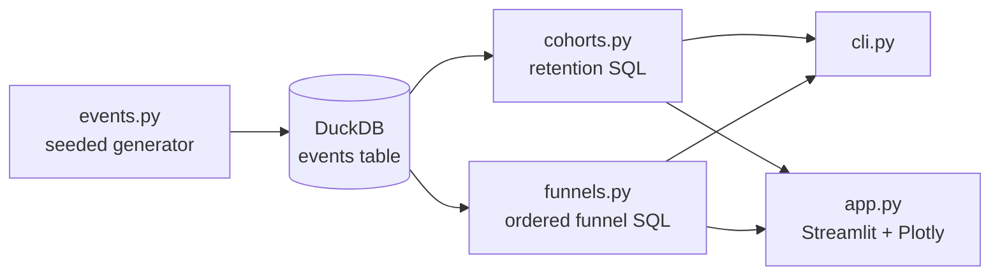

# Cohort & Funnel Analytics

> Cohort retention and step-ordered funnel analysis over a raw event stream, with a Streamlit dashboard — and a running argument with the naive version of both metrics.

[](https://github.com/Prithv122/cohort-funnel/actions/workflows/ci.yml)

**Live demo:** https://cohort-funnel-3msbfxga23gaevkbhy9haa.streamlit.app
**Stack:** Python 3.13 · DuckDB · pandas · Streamlit · Plotly · pytest · ruff · GitHub Actions

---

## 1. The problem

A freemium skilling app spends on paid acquisition and needs two answers before the next
budget cycle: *does a signup cohort keep coming back*, and *where in signup → first lesson
→ completion → quiz → subscribe do users actually fall out*. Both questions are routinely
answered with SQL that looks right and is wrong — a funnel that counts anyone who ever
fired an event, and a retention chart that fills not-yet-happened periods with zero. This
project computes both correctly, and shows what the incorrect version would have told you.

## 2. The data

| | |
|---|---|
| Source | **Synthetic**, generated in-repo by `src/cohortfunnel/events.py` |
| Size | 15,365 events · 4,132 users · 16 weekly cohorts (2026-01-05 → 2026-04-26) |
| Licence | n/a — generated, MIT along with the rest of the repo |
| Refresh | `uv run cohort-funnel build`, deterministic under `SEED = 20260830` |

**The data is synthetic and every number below is therefore a property of the generator,
not a real-world benchmark.** No public dataset exposes raw user-level signup /
activation / subscription events together, so the stream is generated with three
behaviours deliberately planted in it — late activators, users who subscribe without
passing a quiz, and a paid campaign in weeks 6–8 that shifts the channel mix. Those are
the things the analysis is built to catch; the generator is documented in full in its
module docstring.

## 3. Architecture



All aggregation happens in SQL; pandas only ever sees a result set. The CLI, the
dashboard, and the tests call the same two functions, so there is exactly one
implementation of each metric.

## 4. Key decisions & tradeoffs

| Decision | Chose | Over | Why |
|---|---|---|---|
| Funnel semantics | Each step strictly after the previous, inside a conversion window | `count(DISTINCT user_id)` per event | The naive version credits 143 referral-code subscribers who never passed a quiz, inflating end-to-end conversion from **2.7% to 6.2%** — a 2.3× overstatement |
| Conversion window anchor | Configurable `entry` (default) vs `previous` | Hard-coding one | "Converted within 7 days of signup" and "each step follows quickly on the last" are both legitimate; a checkout flow wants the second |
| Unobserved retention cells | `NULL` | `0` | A cohort two weeks old has no week-5 number. Zero-filling drags every curve to the floor and makes the newest cohorts look like a churn crisis |
| Retention definition | Unbounded return (active in period *k* at all) | Consecutive-period retention | Both are defensible; they are not interchangeable, and the harsher one belongs in a subscription-billing context, not a learning app |
| Cohort anchor | First `signup` event | First activity of any kind | Keeps the denominator stable when the activity event changes in the sidebar |
| Engine | DuckDB | pandas `groupby` | The SQL is the transferable artifact — it moves to Postgres/BigQuery nearly unchanged, and the aggregation stays in the engine |
| Filter safety | Column allowlist + bound values | f-string interpolation | Column names cannot be parameterised, so the allowlist *is* the boundary; hostile values are inert (tested) |

## 5. Results

All figures reproducible from a clean clone: `uv run cohort-funnel build` then the command named.

**Ordered vs naive funnel** (7-day window from entry, `cohort-funnel compare`):

| Step | Ordered | Naive | Overcount |
|---|---|---|---|
| signup | 4,132 | 4,132 | 0 |
| lesson_start | 2,413 | 3,133 | +720 |
| lesson_complete | 1,365 | 1,461 | +96 |
| quiz_pass | 680 | 765 | +85 |
| subscribe | **112 (2.71%)** | **255 (6.17%)** | +143 |

The 720-user gap at `lesson_start` is late activators (outside the 7-day window); the
143-user gap at `subscribe` is order violations — referral-code subscribers who never
passed a quiz. A dashboard using the naive counts would report **2.3× the true
signup→subscribe conversion**.

**Retention** (weekly cohorts, activity = `lesson_start`, `cohort-funnel retention`):

| Weeks since signup | 0 | 1 | 2 | 3 | 4 | 5 | 6 |
|---|---|---|---|---|---|---|---|
| Size-weighted retention | 51.7% | 19.4% | 16.4% | 12.7% | 9.1% | 7.7% | 5.8% |

**The campaign finding.** Weeks 6–8 tripled signup volume (432/444/457 vs ~200 baseline)
and week-1 retention for those cohorts fell to **18.2% vs 20.0%** for every other cohort.
Splitting by channel shows it is a mix shift, not a product regression:

| Channel | Signups | Week-1 retention | Week-2 |
|---|---|---|---|
| referral | 457 | **32.9%** | 26.0% |
| organic | 1,208 | 21.8% | 18.0% |
| paid_search | 1,552 | 16.1% | 14.6% |
| social | 915 | **15.4%** | 13.0% |

The campaign bought paid_search and social users at ~2× volume; each channel's own curve
barely moved. Blended retention fell because the *mix* changed — the classic reason a
cohort chart panics a growth team for the wrong reason.

**Engineering:** 33 tests, all expectations hand-computed from fixture rows rather than
captured from a first run; ruff clean; CI on every push.

## 6. How to run

```bash
git clone https://github.com/Prithv122/cohort-funnel.git
cd cohort-funnel
uv sync
uv run pytest                       # 33 tests
uv run cohort-funnel build          # writes data/cohorts.duckdb (~15k events)
uv run cohort-funnel compare        # the ordered-vs-naive table above
uv run cohort-funnel retention --max-periods 6
uv run cohort-funnel funnel --channel referral --window-hours 72
uv run streamlit run src/cohortfunnel/app.py   # dashboard on http://localhost:8501
```

No services, no accounts, no env vars. The dashboard builds the warehouse itself if it is
missing.

## 7. What I'd change at 100× scale

At ~1.5M events the current design still works — DuckDB reads a Parquet lake happily and
the queries are single-pass. It breaks in three places past that:

1. **The funnel CTE chain is one join per step.** At billions of events, the self-join
   pattern loses to a single-pass `MATCH_RECOGNIZE` / sessionised `array_agg` over an
   ordered event array per user, which touches each user's history once.
2. **Recomputing every filter combination from raw events.** I would materialise a
   `user_first_events` table (one row per user per funnel step) incrementally — the funnel
   then joins ~4M user rows instead of scanning 1.5B events, and cohort membership becomes
   a column rather than a subquery.
3. **The dashboard queries the warehouse synchronously.** Past a handful of concurrent
   users this needs pre-aggregated cohort/funnel cubes refreshed on a schedule, with the
   raw path kept only for ad-hoc breakdowns.

Storage would move to partitioned Parquet by `date(event_ts)` so the reporting window is a
partition prune rather than a full scan.

---

## References

None — the funnel and retention SQL here is written from scratch. The window-anchor
distinction (`entry` vs `previous`) is the standard product-analytics definition used by
tools like Amplitude and Mixpanel; no code was consulted.
